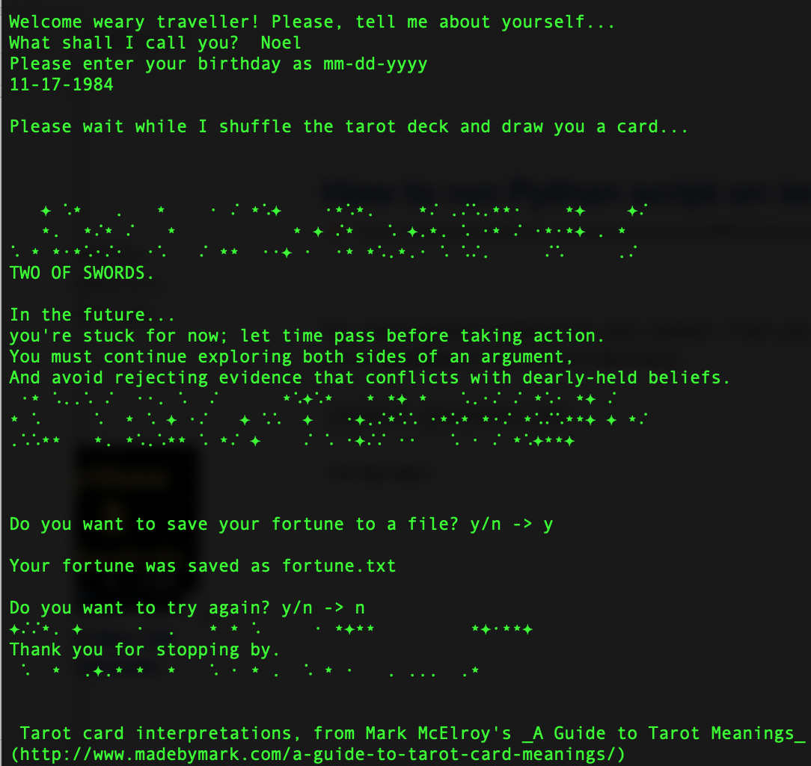
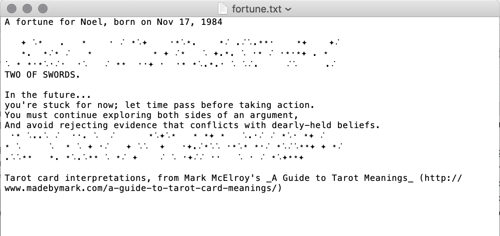

# The Fortune Teller 
_a Python program I developed as an assignment for my PYTHON PROGRAMMING 1 (CIS-1250) class at Central New Mexico Community College, Summer 2020_

Uses Tarot card interpretations from Mark McElroy's [_A Guide to Tarot Meanings_](http://www.madebymark.com/a-guide-to-tarot-card-meanings/). [GitHub link](https://github.com/dariusk/corpora/blob/master/data/divination/tarot_interpretations.json)

## What's the problem?
You want some spiritual guidance but have reasons for not going to a fortune teller, whether it is because you don't have access or don't have faith. Using this fortune telling software program, you allow yourself to be guided toward a solution by telling your problem to the "oracle" and receiving a programmatic fortune generated using actual tarot card interpretation  data. 

I am interested in whether the act of asking 'someone' your fortune, then reading the generalized responses that are in the tarot data, can be of actual psychological help in breaking through problems by activating the users' intuition about what they need to do. For example, in the past I have turned to a page in my copy of the [I Ching](https://en.wikipedia.org/wiki/I_Ching) and felt empowered by what seemed an appropriate explanation of current circumstances. Can a quickie tarot session provide helpful insight, even in the absence of a human reader? 

This project is heavily inspired by the work of Allison Parrish and particularly by her course [Electronic Rituals, Oracles and Fortune Telling](eroft.decontextualize.com/schedule/). After reading the course schedule and a few of the resources listed, I knew I wanted to make something fun that I would never have the chance to make at work, and to explore a more creative application of my Python skills.

## Solution Description
Inputs: 
- user's text input of name
- user input birthdate
- tarot interpretation data via json file

Outputs: 
- printed text prompts, instructions, etc. in terminal
- results (fortune from card data) printed to terminal 
- text file of results generated

Data Models: 
- users text input = strings
- user birthdate = datetime
- tarot data = dict

Functions: 
- Opening "ritual": Greets user & asks for name, birthdate, saving as variables
- Read tarot data file into program as dict
- Retrieve 1 card & related fortune with random 
- Generate a decorative line of "stars" (UTF char string)
- Print info (fortune, light meaning, shadow meaning) to terminal
- Save a text file of user's resulting 'fortune' + their personal info/input
- Ask whether to run again or close [while loop wrapping main control flow]
